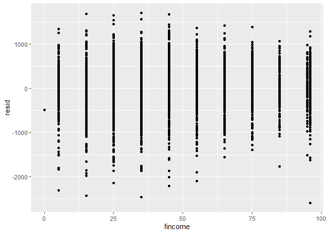
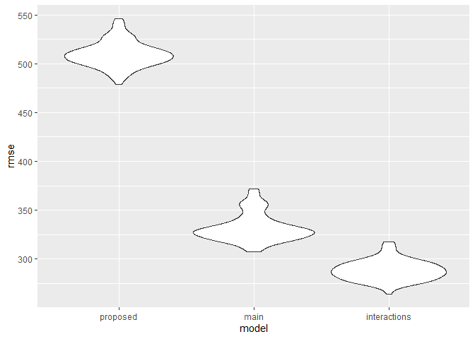

Homework 6
================
Adarsh Ramakrishnan

This is my homework 6 solution:

Loading libraries:

``` r
library(tidyverse)
```

    ## -- Attaching packages ----------------------------------------------- tidyverse 1.3.0 --

    ## v ggplot2 3.3.2     v purrr   0.3.4
    ## v tibble  3.0.3     v dplyr   1.0.2
    ## v tidyr   1.1.2     v stringr 1.4.0
    ## v readr   1.3.1     v forcats 0.5.0

    ## -- Conflicts -------------------------------------------------- tidyverse_conflicts() --
    ## x dplyr::filter() masks stats::filter()
    ## x dplyr::lag()    masks stats::lag()

``` r
library(modelr)
library(p8105.datasets)
```

## Problem 1

``` r
homicide_df = 
  read_csv("data/homicide-data.csv", na = c("", "NA", "Unknown")) %>% 
  mutate(
    city_state = str_c(city, state, sep = ", "),
    victim_age = as.numeric(victim_age),
    resolution = case_when(
      disposition == "Closed without arrest" ~ 0,
      disposition == "Open/No arrest"        ~ 0,
      disposition == "Closed by arrest"      ~ 1)
  ) %>% 
  filter(
    victim_race %in% c("White", "Black"),
    city_state != "Tulsa, AL") %>% 
  select(city_state, resolution, victim_age, victim_race, victim_sex)
```

    ## Parsed with column specification:
    ## cols(
    ##   uid = col_character(),
    ##   reported_date = col_double(),
    ##   victim_last = col_character(),
    ##   victim_first = col_character(),
    ##   victim_race = col_character(),
    ##   victim_age = col_double(),
    ##   victim_sex = col_character(),
    ##   city = col_character(),
    ##   state = col_character(),
    ##   lat = col_double(),
    ##   lon = col_double(),
    ##   disposition = col_character()
    ## )

When looking at Baltimore..

``` r
baltimore_df =
  homicide_df %>% 
  filter(city_state == "Baltimore, MD")
glm(resolution ~ victim_age + victim_race + victim_sex, 
    data = baltimore_df,
    family = binomial()) %>% 
  broom::tidy() %>% 
  mutate(
    OR = exp(estimate),
    CI_lower = exp(estimate - 1.96 * std.error),
    CI_upper = exp(estimate + 1.96 * std.error)
  ) %>% 
  select(term, OR, starts_with("CI")) %>% 
  knitr::kable(digits = 3)
```

| term              |    OR | CI\_lower | CI\_upper |
| :---------------- | ----: | --------: | --------: |
| (Intercept)       | 1.363 |     0.975 |     1.907 |
| victim\_age       | 0.993 |     0.987 |     1.000 |
| victim\_raceWhite | 2.320 |     1.648 |     3.268 |
| victim\_sexMale   | 0.426 |     0.325 |     0.558 |

Let us now run this for all cities..

``` r
models_results_df = 
  homicide_df %>% 
  nest(data = -city_state) %>% 
  mutate(
    models = 
      map(.x = data, ~glm(resolution ~ victim_age + victim_race + victim_sex, data = .x, family = binomial())),
    results = map(models, broom::tidy)
  ) %>% 
  select(city_state, results) %>% 
  unnest(results) %>% 
  mutate(
    OR = exp(estimate),
    CI_lower = exp(estimate - 1.96 * std.error),
    CI_upper = exp(estimate + 1.96 * std.error)
  ) %>% 
  select(city_state, term, OR, starts_with("CI")) 
```

Creating a plot that shows ORs and CIs for each city

``` r
models_results_df %>% 
  filter(term == "victim_sexMale") %>% 
  mutate(city_state = fct_reorder(city_state, OR)) %>% 
  ggplot(aes(x = city_state, y = OR)) + 
  geom_point() + 
  geom_errorbar(aes(ymin = CI_lower, ymax = CI_upper)) + 
  theme(axis.text.x = element_text(angle = 90, hjust = 1))
```

<!-- -->

## Problem 2

Let us first load in and clean the dataset

``` r
bwt_df = 
  read_csv("./data/birthweight.csv")%>%
  janitor::clean_names()%>%
  mutate(babysex = as_factor(babysex),
         frace = as_factor(frace),
         malform = as_factor(malform),
         mrace = as_factor(mrace))
```

    ## Parsed with column specification:
    ## cols(
    ##   .default = col_double()
    ## )

    ## See spec(...) for full column specifications.

Now let us look at a regression model where we regress birthweight bwt
(our outcome) on family monthly income fincome and mother’s race mrace
(our predictors). The purpose of this model is to study the effect of
social factors related to the baby’s mother on the baby’s birthweight.
Mother’s income was chosen since poor income might relate to how healthy
the mother is and in turn the baby’s birthweight.

``` r
bwt_model_proposed = lm(bwt ~ fincome, data = bwt_df)
```

After creating the model, let us plot the residuals of the model against
the fitted values

``` r
bwt_df %>% 
  modelr::add_residuals(bwt_model_proposed) %>% 
  ggplot(aes(x = fincome, y = resid)) + 
  geom_point()
```

<!-- -->

When looking at the residuals, they seem to be fairly evenly distributed
and no specific pattern is observed (no skewness in any direction) which
meets the assumption for linear regression.

Let us now compare this to the two other models. These are the main and
interactions models

``` r
bwt_model_main = lm(bwt ~ blength + gaweeks, data = bwt_df)
bwt_model_interactions = lm(bwt ~ bhead + blength + babysex + bhead*blength + bhead*babysex + blength*babysex + bhead*blength*babysex, data = bwt_df)
```

Now let’s use cross validation to compare the three models

``` r
cross_df =
  crossv_mc(bwt_df, 100) %>% 
  mutate(
    train = map(train, as_tibble),
    test = map(test, as_tibble))

cross_df = 
  cross_df %>% 
  mutate(
    bwt_model_proposed  = map(train, ~lm(bwt ~ fincome, data = .x)),
    bwt_model_main   = map(train, ~lm(bwt ~ blength + gaweeks, data = .x)),
    bwt_model_interactions  = map(train, ~lm(bwt ~ bhead + blength + babysex + bhead*blength + bhead*babysex + blength*babysex + bhead*blength*babysex, data = .x))) %>% 
  mutate(
    rmse_proposed = map2_dbl(bwt_model_proposed, test, ~rmse(model = .x, data = .y)),
    rmse_main   = map2_dbl(bwt_model_main, test, ~rmse(model = .x, data = .y)),
    rmse_interactions = map2_dbl(bwt_model_interactions, test, ~rmse(model = .x, data = .y)))

cross_df %>% 
  select(starts_with("rmse")) %>% 
  pivot_longer(
    everything(),
    names_to = "model", 
    values_to = "rmse",
    names_prefix = "rmse_") %>% 
  mutate(model = fct_inorder(model)) %>% 
  ggplot(aes(x = model, y = rmse)) + geom_violin()
```

<!-- -->

From the plot above, it is clear that the proposed model has a
significantly higher rmse than the main or interactions model. Hence,
the proposed model doesn’t have a very good prediction accuracy. The
main effect model has a slightly higher rmse than the interactions
model. From these 3 models, it appears that the interactions model has
the highest prediction accuracy and is the best model (it “wins”\!).

## Problem 3

Load in the data..

``` r
weather_df = 
  rnoaa::meteo_pull_monitors(
    c("USW00094728"),
    var = c("PRCP", "TMIN", "TMAX"), 
    date_min = "2017-01-01",
    date_max = "2017-12-31") %>%
  mutate(
    name = recode(id, USW00094728 = "CentralPark_NY"),
    tmin = tmin / 10,
    tmax = tmax / 10) %>%
  select(name, id, everything())
```

    ## Registered S3 method overwritten by 'hoardr':
    ##   method           from
    ##   print.cache_info httr

    ## using cached file: C:\Users\adars\AppData\Local\Cache/R/noaa_ghcnd/USW00094728.dly

    ## date created (size, mb): 2020-12-09 18:16:23 (7.552)

    ## file min/max dates: 1869-01-01 / 2020-12-31

We can now create 5000 bootsrap samples for the tmax vs tmin linear
model and extract rsquared and log of slope times intercept for each of
the 5000 samples..

``` r
weather_df_strap = weather_df%>%
  modelr::bootstrap(n = 100) %>% 
  mutate(
    models = map(strap, ~ lm(tmax ~ tmin, data = .x) ),
    terms = map(models, broom::tidy),
    rsquares = map(models, broom::glance)
    )%>%
  unnest(terms)%>%
  select(.id, term, estimate, rsquares)%>%
  unnest(rsquares)%>%
  select(.id, term, estimate, r.squared)%>%
  pivot_wider(names_from = term, values_from = estimate )%>%
  rename(id = .id,
         r_squared = r.squared,
         intercept = `(Intercept)`,
         estimate = tmin)%>%
  mutate(log_estimate_intercept = log(intercept * estimate))
```
